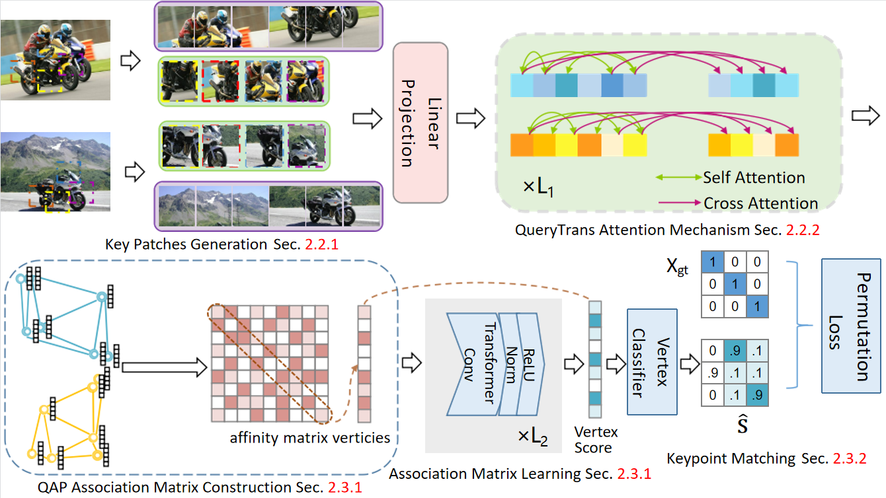

# Graph Matching Transformers
This repository contains the source code to reproduce the experiments in the paper Graph Matching Transformers.



## Setup
We use the environments in [ThinkMatch](https://github.com/Thinklab-SJTU/ThinkMatch).
You can also see more details in [ThinkMatch-runtime](https://github.com/Thinklab-SJTU/ThinkMatch-runtime).

## Data

1. PascalVOC-Keypoint

    1. Download [VOC2011 dataset](http://host.robots.ox.ac.uk/pascal/VOC/voc2011/index.html) and make sure it looks like ``data/PascalVOC/TrainVal/VOCdevkit/VOC2011``
    
    1. Download keypoint annotation for VOC2011 from [Berkeley server](https://www2.eecs.berkeley.edu/Research/Projects/CS/vision/shape/poselets/voc2011_keypoints_Feb2012.tgz) or [google drive](https://drive.google.com/open?id=1D5o8rmnY1-DaDrgAXSygnflX5c-JyUWR) and make sure it looks like ``data/PascalVOC/annotations``
    
    1. The train/test split is available in ``data/PascalVOC/voc2011_pairs.npz``. **This file must be added manually.**
    
1. SPair-71k

    1. Download [SPair-71k dataset](http://cvlab.postech.ac.kr/research/SPair-71k/)

    1. Unzip the dataset and make sure it looks like ``data/SPair-71k``

Our code also supports [Willow-Object-Class](http://www.di.ens.fr/willow/research/graphlearning/WILLOW-ObjectClass_dataset.zip),
[CUB2011](http://www.vision.caltech.edu/visipedia-data/CUB-200-2011/CUB_200_2011.tgz)
and [IMC-PT-SparseGM](https://drive.google.com/file/d/1C3xl_eWaCG3lL2C3vP8Fpsck88xZOHtg/view?usp=sharing) datasets, 
please refer to [ThinkMatch](https://github.com/Thinklab-SJTU/ThinkMatch) for more deatails.

## Pretrained Backbones
Please download the pretrained parameters for GMT, ViT, CeiT and XCiT backbones from [google drive](https://drive.google.com/drive/folders/1HjiYZUDJt3MN1SHsjEzanIN8vOVetDec?usp=drive_link) 
and make sure it looks like ``experiments/pretrained``

## Experiments
Please place all the yaml files in the ``experiments`` directory.

If you have already built the singularity with docker image, use the following command:
```angular2html
singularity exec \
     --nv \
     --bind /data:/data \
     gm_env.sif \
     bash -c "CUDA_VISIBLE_DEVICES=0 python train_eval.py --cfg experiments/[backbone]_[framework]_[dataset].yaml"
```

Or if you have prepared your environments in other ways (e.g. conda), you can run
```angular2html
python train_eval.py --cfg experiments/[backbone]_[framework]_[dataset].yaml
```

We support the following choices:
```angular2html
[backbone]: vgg16, resnet34, gmt, gmt_small, vit, vit_small, ceit, xcit
[framework]: ngmv2, bbgm
[dataset]: voc, spair71k
```
We also provide the yaml files including GMT and ViT backbones with NGMv2 and BBGM frameworks on Willow-Object-Class dataset.

For other backbones on Willow-Object-Class, CUB2011, IMC-PT-SparseGM datasets, please download the corresponding yaml files from [ThinkMatch](https://github.com/Thinklab-SJTU/ThinkMatch).